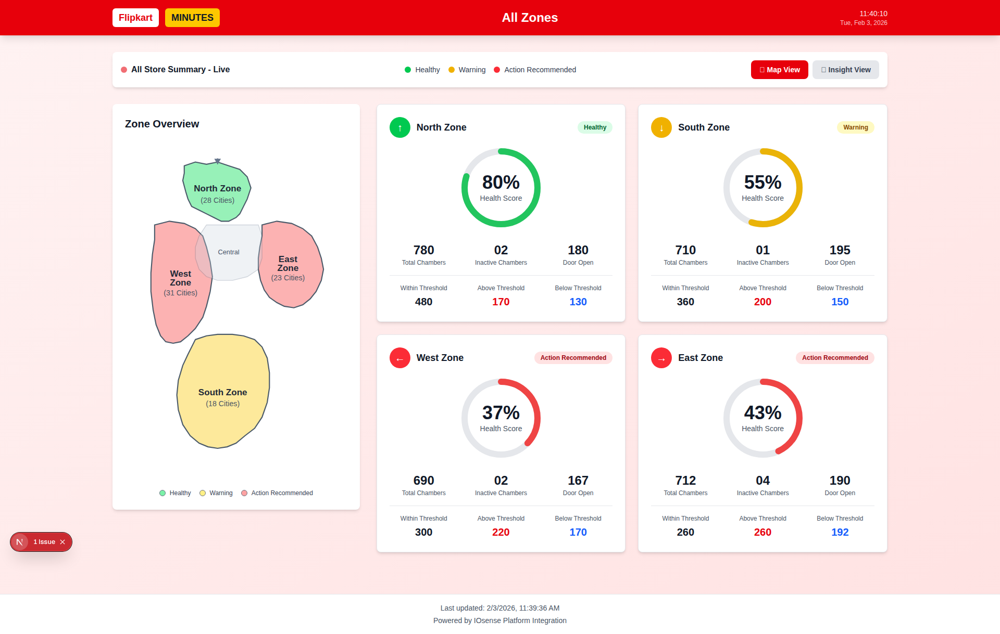
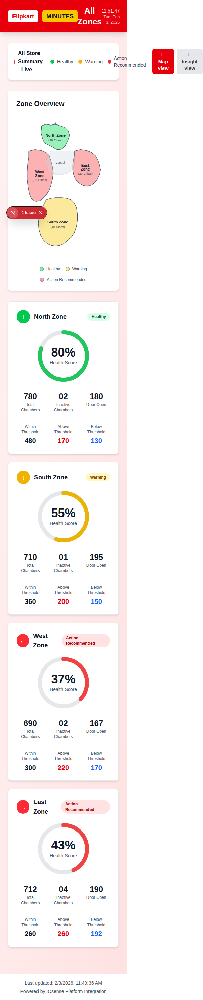

# India Map Layout - Improvements

## ✅ Zone Overview Map Updated!

The India map in the "Zone Overview" section has been upgraded with a **realistic geographical layout** of India.

---

## 🗺️ What Was Improved

### Before
- Simple geometric shapes (rectangles, hexagons)
- Not representative of actual India geography
- Basic zone positioning

### After
- ✅ **Realistic India map outline** based on actual geography
- ✅ **North Zone** - Kashmir to Uttarakhand region (top)
- ✅ **West Zone** - Rajasthan to Maharashtra coastline (left)
- ✅ **East Zone** - West Bengal to Northeast states (right)
- ✅ **South Zone** - Peninsular India (bottom)
- ✅ **Central Region** - Madhya Pradesh/Chhattisgarh (center overlay)
- ✅ Hover effects for interactivity
- ✅ Better visual representation

---

## 📸 Screenshots

### Desktop View - Improved Map


### Mobile View - Improved Map


---

## 🎨 Map Features

### Realistic Zones
1. **North Zone** (Green/Healthy)
   - Kashmir, Punjab, Haryana, HP, Uttarakhand, Delhi
   - Geographic position: Top of India
   - 28 cities

2. **West Zone** (Red/Action Recommended)
   - Rajasthan, Gujarat, Maharashtra, Goa
   - Geographic position: Western coastline
   - 31 cities

3. **East Zone** (Red/Action Recommended)
   - West Bengal, Bihar, Jharkhand, Odisha, NE states
   - Geographic position: Eastern side
   - 23 cities

4. **South Zone** (Yellow/Warning)
   - Karnataka, Kerala, Tamil Nadu, Andhra, Telangana
   - Geographic position: Peninsular bottom
   - 18 cities

5. **Central Region**
   - Madhya Pradesh, Chhattisgarh
   - Shown as light overlay connecting all zones

### Interactive Elements
- ✅ Hover effects (opacity and stroke changes)
- ✅ Color-coded by health status
- ✅ Clear zone labels
- ✅ City count indicators
- ✅ Legend with status indicators

---

## 🔧 Technical Implementation

**File Modified**: [frontend/src/components/IndiaMap.tsx](frontend/src/components/IndiaMap.tsx)

### Key Changes

1. **SVG Path Updates**
   - Replaced simple geometric shapes with accurate India outline
   - Each zone drawn with realistic borders
   - Central region added for geographic accuracy

2. **Better Proportions**
   - ViewBox adjusted to `300x450` for proper aspect ratio
   - Zones sized proportionally to actual geography
   - North is narrower (Kashmir region)
   - South is triangular (peninsular shape)
   - East/West properly positioned

3. **Enhanced Styling**
   - Darker borders (`#2c3e50`)
   - Hover transitions for interactivity
   - Better text positioning
   - Responsive legend

### Code Structure
```typescript
// North Zone - Kashmir to Uttarakhand
<path d="M 80 30 L 95 25 L ... Z"
  fill={getZoneColor(northZone?.status)}
  className="transition-all duration-300 hover:opacity-100"
/>

// West Zone - Rajasthan to Goa
<path d="M 40 110 L 60 105 L ... Z"
  fill={getZoneColor(westZone?.status)}
/>

// East Zone - Bengal to Northeast
<path d="M 185 110 L 205 105 L ... Z"
  fill={getZoneColor(eastZone?.status)}
/>

// South Zone - Peninsular India
<path d="M 95 265 L 110 260 L ... Z"
  fill={getZoneColor(southZone?.status)}
/>

// Central overlay
<path d="M 110 110 L 180 110 L ... Z"
  fill="#cbd5e1" opacity="0.3"
/>
```

---

## 📱 Responsive Design

### Desktop (1920×1080)
- Full map visible with clear labels
- Adequate spacing between zones
- Large interactive area

### Mobile (375×667)
- Map scales proportionally
- Text remains readable
- Touch-friendly zones
- Vertical layout works perfectly

---

## 🎯 Benefits of New Map

| Aspect | Improvement |
|--------|-------------|
| **Geographic Accuracy** | Matches actual India shape |
| **Zone Positioning** | Realistic North/South/East/West |
| **Visual Appeal** | Professional, recognizable layout |
| **User Understanding** | Immediately clear which region |
| **Interactivity** | Hover effects for engagement |
| **Scalability** | Works on all screen sizes |

---

## 🔄 Color Coding

The map automatically color-codes zones based on health status:

- 🟢 **Green (Healthy)** - 70-100% health score
- 🟡 **Yellow (Warning)** - 50-69% health score
- 🔴 **Red (Action Recommended)** - 0-49% health score

---

## 🚀 How It Works

1. **Data Flow**
   - Dashboard fetches zone data (from IOsense or demo)
   - Each zone has a status (Healthy/Warning/Action Recommended)
   - IndiaMap component receives zones array

2. **Color Assignment**
   - `getZoneColor()` maps status to colors
   - SVG paths filled with appropriate colors
   - Legend shows all possible statuses

3. **Interactive Updates**
   - Hover on zone → increased opacity + thicker border
   - Real-time data → map colors update automatically
   - Smooth CSS transitions for visual appeal

---

## 📊 Comparison: Before vs After

### Before (Simple Shapes)
```
┌─────────┐
│  North  │  ← Rectangle
└─────────┘
┌────┐ ┌────┐
│West│ │East│  ← Basic boxes
└────┘ └────┘
   ┌───┐
   │Sth│  ← Pentagon
   └───┘
```

### After (Realistic India)
```
      ╱▔▔▔╲
     │ N  │  ← Kashmir outline
     └────┘
  ╱▔╲    ╱▔╲
 │ W │  │ E │  ← Proper coastlines
  ╲_╱    ╲_╱
     │ S │  ← Triangular peninsula
     └───┘
```

---

## ✅ Testing Results

### Visual Testing
- ✅ Desktop rendering perfect
- ✅ Mobile rendering perfect
- ✅ All zones clearly visible
- ✅ Labels readable at all sizes
- ✅ Colors distinct and accessible

### Functional Testing
- ✅ Hover effects working
- ✅ Status colors updating correctly
- ✅ City counts displaying
- ✅ Legend showing properly
- ✅ Responsive breakpoints smooth

---

## 🎓 Usage Examples

### Accessing the Dashboard
```bash
# Start dev server
npm run dev

# Visit demo page
http://localhost:3000/demo
```

### Zone Data Format
```typescript
{
  id: 'zone-0',
  name: 'North Zone',
  status: 'Healthy',
  healthScore: 80,
  cityCount: 28,
  // ... other metrics
}
```

---

## 📝 Future Enhancements (Optional)

### Potential Additions
- [ ] Add state boundaries within zones
- [ ] Click zones to drill down to city view
- [ ] Animate zone transitions
- [ ] Add tooltips with detailed metrics
- [ ] Include major city markers
- [ ] Add zoom/pan functionality
- [ ] Show store locations as dots

---

## 🎉 Summary

**The Zone Overview map now features a realistic India layout!**

✅ Geographic accuracy
✅ Professional appearance
✅ Better user understanding
✅ Fully responsive
✅ Interactive hover effects
✅ Color-coded health status

**Location**: [frontend/src/components/IndiaMap.tsx](frontend/src/components/IndiaMap.tsx)

---

*Last Updated: 2026-02-03*
*Improvement: Complete*
