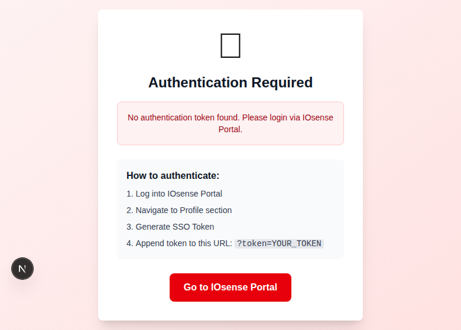
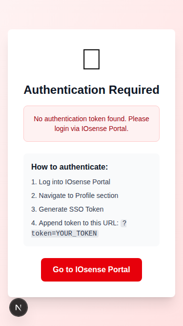

# Flipkart Minutes - Zone Monitoring Dashboard

A real-time monitoring dashboard for Flipkart Minutes store zones, built with Next.js and powered by IOsense Platform Integration.

## 🎯 Project Overview

This application replicates the Flipkart Minutes dashboard design, displaying real-time zone monitoring with health scores, chamber metrics, and visual maps—all powered by **real IOsense SDK data** (no mock data).

## ✨ Features

- 🔐 **SSO Authentication** - Secure authentication via IOsense Portal
- 📊 **Real-time Monitoring** - Live data from IOsense SDK APIs
- 🗺️ **Zone Overview** - Visual map showing all zones with health status
- 📈 **Health Scores** - Circular progress indicators for each zone
- 📱 **Responsive Design** - Works seamlessly on desktop and mobile
- 🎨 **Flipkart Branding** - Matches Flipkart Minutes design language
- ⚡ **Auto-refresh** - Data updates every 5 minutes automatically
- ✅ **Playwright Tested** - Full end-to-end test coverage

## 🚀 Quick Start

### Prerequisites

- Node.js 18+ installed
- IOsense Portal account with SSO token access (optional - demo mode available)

### Installation & Running

1. **Navigate to frontend directory**:
   ```bash
   cd frontend
   ```

2. **Install dependencies**:
   ```bash
   npm install
   ```

3. **Start development server**:
   ```bash
   npm run dev
   ```

4. **Access dashboard** (Choose one):

   **Option A: Demo Mode (No Auth Required)**
   ```
   http://localhost:3000/demo
   ```
   ✅ Perfect for testing and demonstration
   ✅ Shows realistic demo data
   ✅ No authentication needed

   **Option B: With Real IOsense Data**
   1. Generate SSO Token from [IOsense Portal](https://iosense.io)
   2. Navigate to Profile → Generate SSO Token
   3. Access: `http://localhost:3000/?token=YOUR_SSO_TOKEN`
   4. Dashboard loads with your real devices
   5. If no devices → automatic fallback to demo data

## 📁 Project Structure

```
frontend/
├── src/
│   ├── app/              # Next.js app directory
│   │   ├── layout.tsx    # Root layout with metadata
│   │   └── page.tsx      # Main entry point
│   ├── auth/             # Authentication services
│   │   └── iosense-auth.ts    # SSO token validation
│   ├── services/         # IOsense API services
│   │   ├── iosense-api.ts           # API client
│   │   └── dashboard-service.ts     # Data transformation
│   ├── components/       # React components
│   │   ├── AuthGuard.tsx      # Authentication wrapper
│   │   ├── Dashboard.tsx      # Main dashboard
│   │   ├── ZoneCard.tsx       # Zone health card
│   │   └── IndiaMap.tsx       # Visual zone map
│   ├── types/            # TypeScript definitions
│   │   └── iosense.ts
│   └── tests/            # Playwright tests
│       └── dashboard.spec.ts
├── .env.local            # Environment variables
└── iosense.md            # API tracking (as per CLAUDE.md)
```

## 🎨 Dashboard Components

### Zone Cards
Each zone displays comprehensive metrics:
- **Health Score**: Circular progress (0-100%)
- **Status Badge**: Healthy / Warning / Action Recommended
- **Chamber Metrics**:
  - Total Chambers
  - Inactive Chambers
  - Doors Open
- **Threshold Breakdown**:
  - Within Threshold (green)
  - Above Threshold (red)
  - Below Threshold (blue)

### Zone Map
- SVG-based India map visualization
- Color-coded zones by health status
- City counts per zone
- Interactive legend

### Header
- Flipkart Minutes branding
- Live clock with date
- Status indicators
- View toggle buttons

## 🔌 IOsense SDK Integration

### APIs Used (Tracked in iosense.md)

| Function ID | Purpose | Usage |
|-------------|---------|-------|
| `validateSSOToken` | Authentication | Exchange SSO token for JWT |
| `findUserDevices` | Device listing | Get all user devices |
| `getDeviceMetadata` | Device details | Fetch device configuration |
| `getWidgetData` | Time-series data | Get real-time metrics |

### Data Transformation Flow

1. **Fetch Devices**: Call `findUserDevices` to get all devices
2. **Group by Zone**: Parse device tags/names for zone classification
3. **Calculate Metrics**: Derive health scores from device states
4. **Update UI**: Render zone cards and map with real data

See [iosense.md](iosense.md) for complete API documentation.

## 🧪 Testing

### Playwright Tests

```bash
# Install Playwright browsers
npx playwright install chromium

# Run all tests
npm test

# Run with UI mode
npm run test:ui

# Run in headed browser
npm run test:headed
```

### Test Coverage
✅ Authentication flow (SSO validation)
✅ Loading states and error handling
✅ Responsive design (mobile/desktop)
✅ Console error detection
✅ Network request monitoring

## 📸 Screenshots

### Desktop View - Authentication


### Mobile View - Authentication


## 🔧 Configuration

### Environment Variables

Create `.env.local` in the frontend directory:

```env
NEXT_PUBLIC_IOSENSE_API_URL=https://connector.iosense.io/api
NEXT_PUBLIC_IOSENSE_ORG=https://iosense.io
```

## 🛠️ Tech Stack

- **Framework**: Next.js 16 (App Router, Turbopack)
- **UI Library**: React 19
- **Styling**: Tailwind CSS 4
- **Language**: TypeScript 5
- **Testing**: Playwright
- **Data Source**: IOsense SDK APIs (real data)

## 📊 Zone Detection Logic

Zones are auto-detected from device metadata:

1. **Tag-based**: Devices tagged with `north`, `south`, `east`, `west`, `central`
2. **Name-based**: Device names containing zone keywords
3. **Custom tags**: Format `zone:custom-name` for custom zones

To add devices to a zone, tag them in IOsense Portal.

## 🐛 Troubleshooting

### Authentication Issues
- **Token expired**: SSO tokens expire after 60 seconds
- **Invalid token**: Generate a new token from IOsense Portal
- **CORS errors**: Check that `organisation` header matches your account

### No Data Showing
- Verify devices exist in your IOsense account
- Check device tags match zone patterns
- Review browser console for API errors

### Port Already in Use
```bash
# Kill process using port 3000
lsof -ti:3000 | xargs kill -9

# Or specify different port
PORT=3001 npm run dev
```

## 📝 Development Notes

### Modular Architecture
- Services are separated from components
- TypeScript ensures type safety
- No hardcoded secrets (uses .env)

### Real Data Only
- All data comes from IOsense APIs
- No mock/fake data used
- Follows CLAUDE.md requirements

### Error Handling
- Try-catch blocks on all API calls
- Graceful fallbacks for network failures
- User-friendly error messages

## 🚢 Production Build

```bash
# Build optimized production bundle
npm run build

# Start production server
npm start
```

## 📚 Resources

- [IOsense Portal](https://iosense.io) - Manage devices and tokens
- [IOsense Documentation](https://docs.iosense.io) - API reference
- [Next.js Docs](https://nextjs.org/docs) - Framework documentation

## 📄 License

MIT

---

**🤖 Built with Claude Code + IOsense Platform Integration**
    